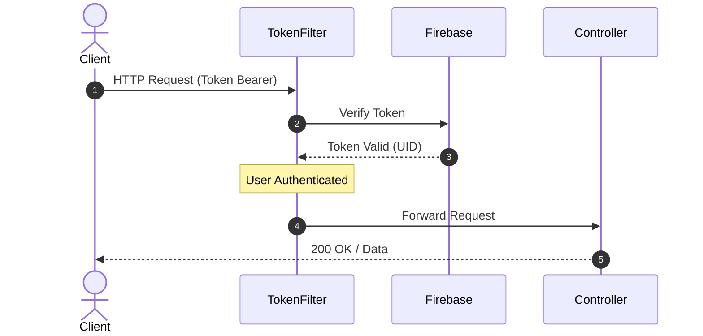
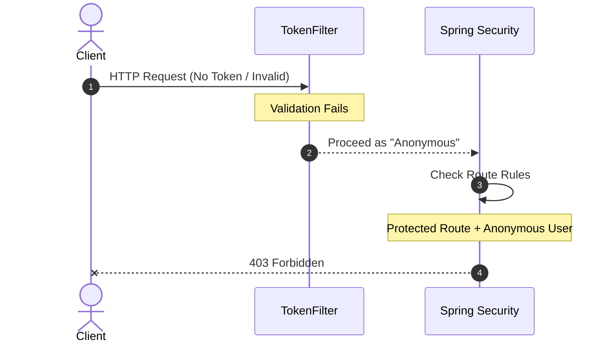

 

---

 # NotesVault 
NotesVault is a cloud-based application designed to manage notes efficiently and securely. It allows users to create, read, update, and delete notes with ease. The project was born from a personal interest in having a dedicated note management tool, with a strong focus on security, organization, and scalability.

## Current Technologies  
      

## Current Features 🌱 
- Create, read, update, and delete notes (CRUD).
- Account confirmation through token validation via email.
- Account deletion through token validation via email.
- Soft delete: notes and accounts are marked as inactive instead of permanent removal.
- Password recovery through token validation.
- Cloud storage with Firestore.
- MVC architecture implemented with Spring Boot.

## 📌 Current Progress and Planned Improvements

- [x] Basic CRUD functionality for notes  
- [x] Authentication system with registration, login, and email confirmation  
- [x] Password recovery flow with token validation via email  
- [x] Soft delete: notes and accounts are marked as inactive instead of permanently removed
- [x] Modify authentication module with firestore built in functions
- [X] Adapt crud methods to use the uid
- [ ] Token-based authentication for all note-related operations (CRUD)  [In progress...]
- [ ] Use token in the crud endpoints 
- [ ] Encrypt notes content before storage
- [ ] General Testing with github actions
- [ ] Enhanced security measures (improved token handling, etc...)  
- [ ] Advanced search and tagging system for notes  
- [ ] Auto-save and real-time synchronization of notes across devices 
- [ ] Image support: attach and manage images within notes
- [ ] RESTful API fully documented and standardized  
- [ ] Frontend design prototype in Figma  
- [ ] Additional improvements coming soon... 

##  API Endpoints 📡

### 🔑 Authentication
- **POST**   `/auth/register`             Register a new user account  
- **GET**    `/auth/confirm`              Confirm account via email with verification token  
- **POST**   `/auth/resend-confirmation`  Resend account confirmation email with new token  
- **POST**   `/auth/login`                Authenticate user and receive access token  

### 🔐 Recovery
- **POST**   `/recovery/request`        Send recovery email with secure token  
- **POST**   `/recovery/verify-token`   Validate the recovery token  
- **POST**   `/recovery/reset-password` Set a new password using a valid token  
- **GET**    `/recovery/reset`          Handle recovery link validation from email  

### 📝 Notes (CRUD)
- **POST**   `/note/create`              Create a new note  
- **GET**    `/note/read`                Retrieve all notes for the authenticated user  
- **PATCH**  `/note/update/{noteId}`     Update an existing note by ID  
- **DELETE** `/note/delete`              Soft delete a note (mark as inactive)  

## 🧪 Testing
 All endpoints have been tested using Postman and Swagger UI.

## 🏗️ Architecture & Security Flow
These diagrams illustrate the secure authentication flow implemented using **Spring Security** and **Firebase Auth**. It highlights how requests are intercepted to validate JWT tokens before reaching the protected endpoints.
Simplified secure request flow:

### ✅ Authenticated Request Flow

This diagram shows how a request with a valid token is processed:

### 🚫 Error/Unauthorized Request Flow

When a request lacks a valid token or validation fails:

---
