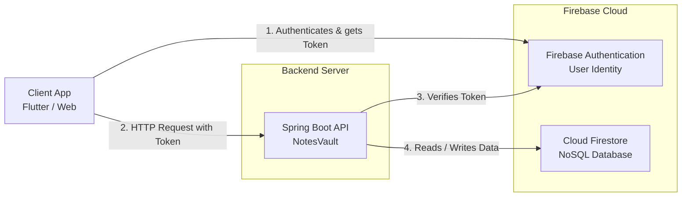

# System Architecture

This diagram illustrates the high-level architecture of NotesVault. It demonstrates how a client (e.g., a Flutter mobile or web app) interacts with the Spring Boot backend, and how authentication and data storage are handled via Firebase.

## Description
1. **Client App**: The frontend application, potentially built with Flutter, which the user interacts with.
2. **Firebase Auth**: The client authenticates directly with Firebase Auth to receive a JWT (JSON Web Token).
3. **Spring Boot API**: The core backend. It intercepts requests, validates the JWT against Firebase Auth, and processes business logic.
4. **Cloud Firestore**: The database where user data and notes are stored. The backend communicates with it using the Firebase Admin SDK.
