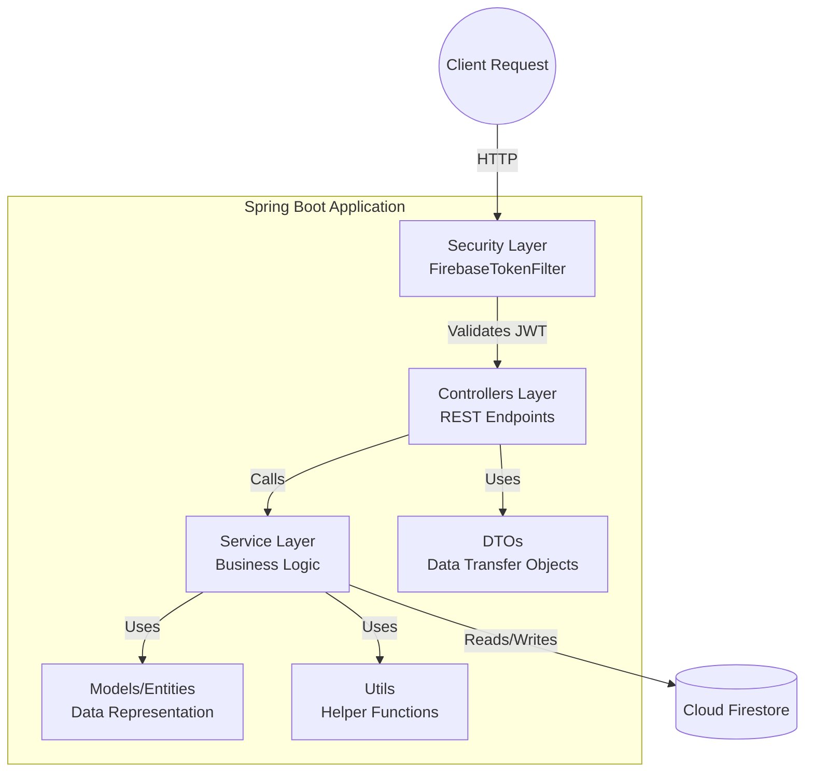

# Component Architecture

This diagram shows the internal component structure of the Spring Boot application (NotesVault). It follows a standard MVC / REST API pattern.

## Description
- **Security Layer**: Intercepts requests using a custom `FirebaseTokenFilter` to ensure the user is authenticated before reaching the controllers.
- **Controllers Layer**: Defines the RESTful endpoints (e.g., `/note/create`, `/auth/login`).
- **Service Layer**:  Where the core business logic resides, abstracting it away from the controllers.
- **DTOs**: Objects used to transfer data between the client and the server without exposing the internal models.
- **Models/Entities**: Java classes representing the data stored in the database (e.g., `Note`, `User`).
