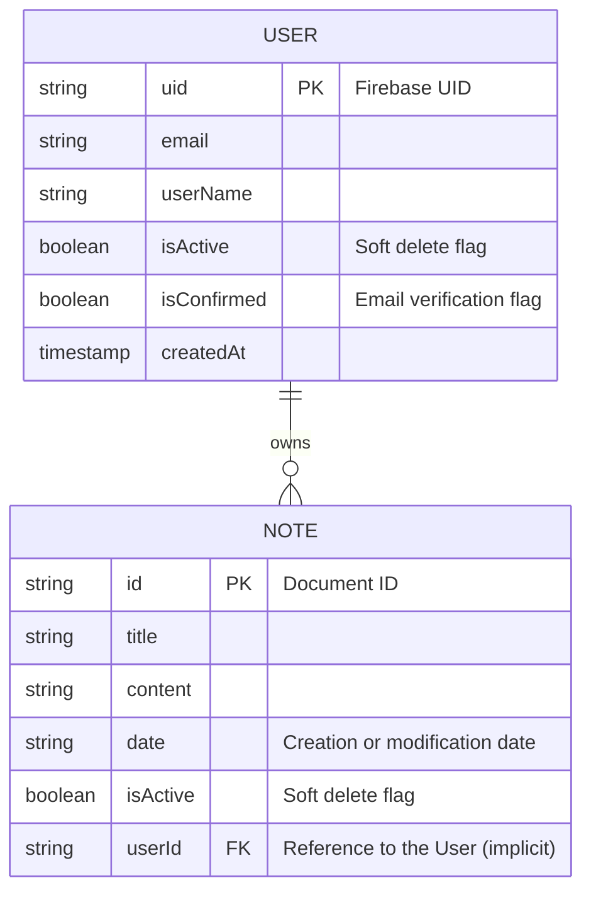

# Data Model

This diagram illustrates the core entities stored in Cloud Firestore.

## Entities

### User
Represents a user account in the system. The `uid` matches the identifier provided by Firebase Authentication.
- **Soft Delete**: Instead of permanently deleting the user, the `isActive` flag is set to false.

### Note
Represents a text note created by a user.
- **Soft Delete**: Deleting a note sets `isActive` to false, preserving the data for potential recovery.
