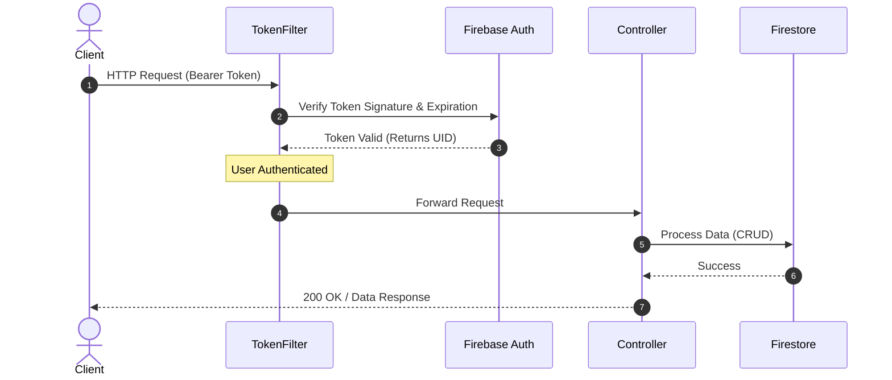
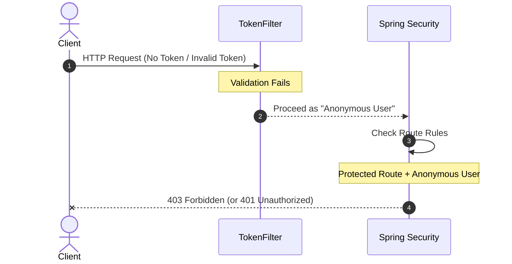

# Sequence Diagrams

These diagrams illustrate the secure authentication flow implemented using **Spring Security** and **Firebase Auth**. They highlight how requests are intercepted to validate JWT tokens before reaching the protected endpoints.

## 1. Authenticated Request Flow

This diagram shows how a request with a valid token is processed:

## 2. Error / Unauthorized Request Flow

When a request lacks a valid token or validation fails:

